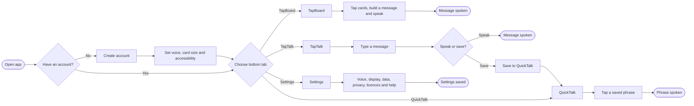

# TapTalk AAC User Flow

This file is the simple, version-controlled source of truth for the app flow. It renders directly in GitHub and can be recreated visually in FigJam or Figma when screen design begins.

**Editable visual board:** [TapTalk AAC User Flow Wireframe in FigJam](https://www.figma.com/board/0T8h0DmQeU0GxHQLMLQvum)

## Main app flow

This is the high-level navigation flow. Detailed editing, deletion, error, and recovery flows should be designed separately so the main journey stays easy to scan.

## Flow rules

- TapBoard, TapTalk, and QuickTalk are the three main destinations.
- Settings is available from every main screen but is not a fourth main communication tab.
- The message bar stays familiar across communication screens where practical.
- Speaking, stopping speech, and clearing a message must always be easy to find.
- Destructive actions require confirmation; ordinary communication actions do not.
- Every flow must work with VoiceOver and large touch targets and must not create a dead end.
